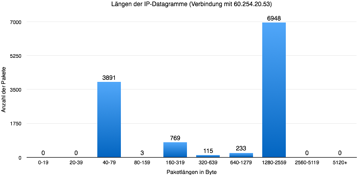

# Block 7

#### Tutorium 10, Gruppe 5
- Sarah Köhler
- Florian Schiller
- Dora Szücs

## Aufgabe 5

##### a) Anzahl Pakete im Trace: 62856  
*Anzeige in Fußleiste*

##### b) Durchschnittliche Größe der Pakete: 614.576 Byte
*statistics -> Summary*

##### c) vorkommende MAC-Adressen:

- DellInc_cc7:76:0e
- D_linkCo_fc:75:2b
- IbmCorp_43:ca:fe
- Broadcast
 *über statistics - endpoints [Ethernet]*

##### d) Anzahl vorkommender IP- Adressen: 172
*statistics -> endpoints [IPv4]*
 *für TCP/UDP sind gleiche Ip mit anderem Port verschiedene Endpoints*

##### e) Verknüpfungen von MAC-Adressen mit IP-Adressen:

- `D-LinkCo_fc:75:2b` 	verschiedene, die Adresse ändert sich häufig, beispielsweise: 66.171.184.188
- `Delllnc_c7:76:0e`		192.168.0.4
- `Broadcast`						192.168.0.255
- `IbmCorp_43:ca:fe` 		102.168.0.2

##### f) Anteil der Pakete wo IP auf der Netzwerkschicht verwendet wird: quasi 100% (nur 2 von allen Paketen nicht)
*statistics -> Protocol Hierarchy Statistics*

##### g) Anteil der Pakete wo TCP auf der Transportschicht verwendet wird: 90.07%
*statistics -> Protocol Hierarchy Statistics*

##### h) alle Protokolle der Applikationsschicht, die TCP nutzen:

- SSH
- HTTP
- SSL
- BitTorrent
- Real Time Streaming Protocol (RTSP)

##### i) alle Protokolle der Applikationsschicht, die UDP nutzen:

- DNS
- NetBIOS Datagram Service
- NetBIOS Name Service

##### j) auftauchende Protokolle der Netzwerkschicht:

- ARP (Adress Resolution Protocol)
- IPv4

*Statistics -> Protocol Hierarchy*

##### k) auftauchende Protokolle der Sicherungsssicht

- Ethernet

##### l) Anzahl DNS-Abfragen: 17 Anfragen
*Filter: dns && ip.src==192.168.0.4 (Antworten ausgeschlossen)*

##### m) Anzahl IP-Pakete mit:

- TTL >= 200 : 23 Pakete
- TTL = 128 : 26757 Pakete
- TTL = 48 : 105

*Filter: ip.ttl == 128 [und analog]*

###### Erklärung dieser Verteilung: 
Die TTL sagt etwas über die Anzahl der Stationen aus, die ein Paket zu seinem Zielort maximal haben darf.
Wenn die TTL sehr klein ist, wird das Paket sehr schnell verworfen.
Ist sie zu lang, können mögliche Fehler bei der Übertragung später gefunden werden.
Anscheinend hat sich eine TTL von 128 als beste Angabe herausgestellt, weshalb es zu dieser Verteilung kam.

##### n) Paket 16
###### a) Größe des Ethernet-Header: 14 bytes
*Paket auswählen, Ethernet auswählen > Größe in der Statusleiste ablesen*
###### b) Größe des Ip-Header: 20 bytes
*analog zu a)*
###### c) Größe des IP-Datagramm: 1360 bytes
total Length - Header length = Datagramm Length
###### d) Größe TCP-Header: 20 bytes
*analog zu a)*
###### e) Größe TCP-Segment: 1340 Bytes
*Angabe neben Data bzw Length Wert ganz am Ende*

##### o) Verteilung der Länger der IP-Datagramme:

*statistics -> packet lengths (Filter IP)*

##### p) Verteilung der Länger der IP-Datagramme bei der Verbindung, wo die meisten Bytes übertragen werden

*Endpoints, Tab Ipv4, sortieren nach Bytes -> IP-Adresse mit meisten Bytes als Filter einstellen, dann Paketlängen wie bei o)*

##### q) SSH-Verbindung und beteiligte Hosts: Ja, es bestand eine SSH-Verbindung zwischen 192.168.0.4 und 136.159.5.20.
*Filter: ssh*

##### r) Webbrowser genutzt (welcher): 	
Unter den DNS Anfragen ist eine Anfrage dabei, die die Adresse fxfeeds.mozilla.org abruft. Dieser Server wird von FireFox benutzt, um die Bookmark-Liste abzurufen.
Das lässt darauf schließen, dass als Browser FireFox zum Einsatz kam.
 *Filter dns and udp and ip and eth and frame*

##### s) Medienstream genutzt? welcher?
Es wurde ein Videostream genutzt, zu sehen daran, dass der folgende Link abgerufen wurde:
[rtsp://a1651.v87522.c8752.g.vr.akamaistream.net:554/ondemand/7/1651/8752/1137095087000/origin.media.cbc.ca/newsworld/real/clips/rm-newsworld/debate_060110.rm?title=&quot;Harper%20fends%20off%20attacks%20from%20Duceppe%2c%20Martin%20in%20final%20debate&quot;&amp;author=&quot;CBC%20News&quot;&amp;copyright=&quot;CBC%20News&quot;](rtsp://a1651.v87522.c8752.g.vr.akamaistream.net:554/ondemand/7/1651/8752/1137095087000/origin.media.cbc.ca/newsworld/real/clips/rm-newsworld/debate_060110.rm?title=&quot;Harper%20fends%20off%20attacks%20from%20Duceppe%2c%20Martin%20in%20final%20debate&quot;&amp;author=&quot;CBC%20News&quot;&amp;copyright=&quot;CBC%20News&quot;) 

Der Film heißt also vermutlich: "Harper fends off attacks from Duceppe Martin in final Debate".

Eine Google Suche ergab folgenden Artikel: http://www.cbc.ca/news/canada/harper-fends-off-attacks-from-duceppe-martin-in-final-debate-1.608436 .
Das Video scheint jedoch nicht mehr verfügbar zu sein.
 *Filter: rtsp and tcp and ip and eth and frame*

##### t) P2P-Filesharing genutzt? (Details)
Ja, über BitTorrent, wie man in Aufgabe h) sehen kann, das das BitTorrent Protokoll verwendet wurde.
Es wurde wahrscheinlich eine Datei weitergegeben. Welche dies war. lässt sich aber nicht herausfinden.
  *Filter: bittorrent and tcp and ip and eth and frame*
